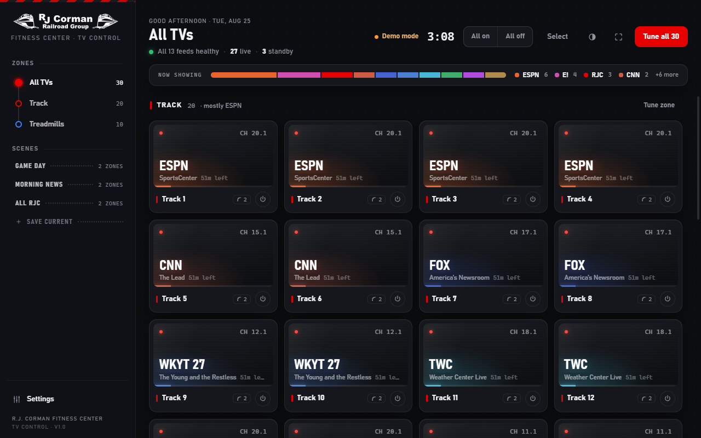
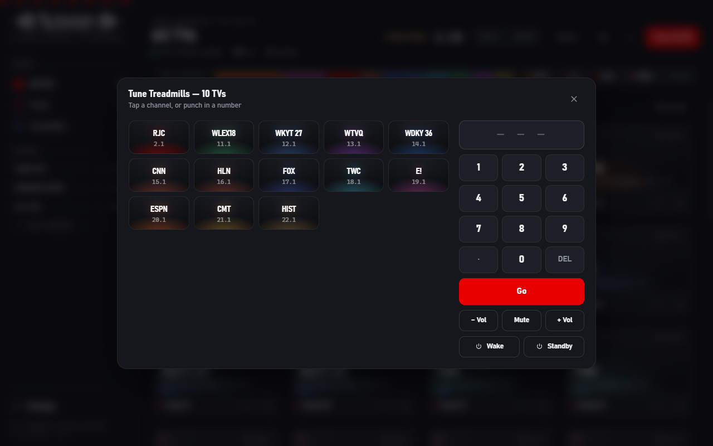
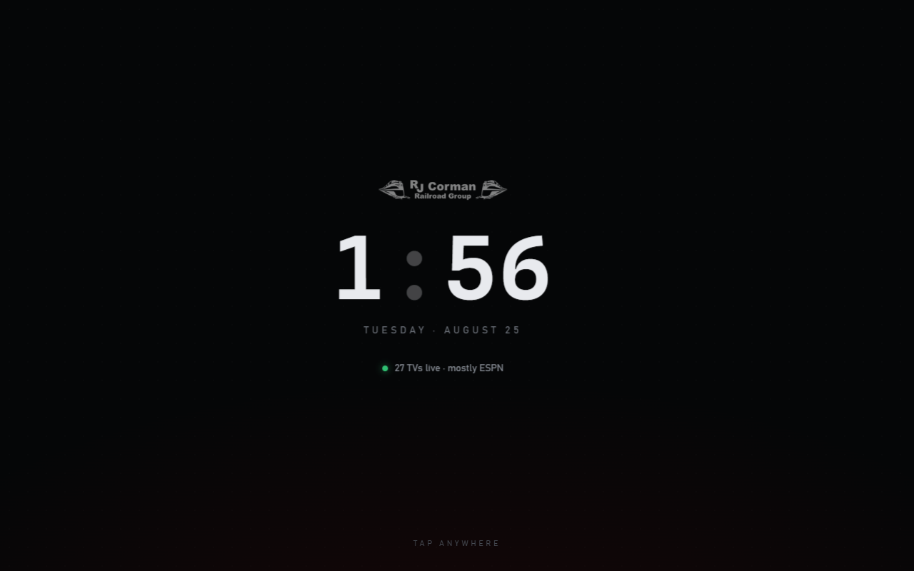
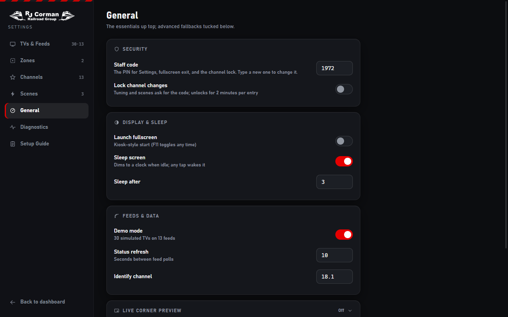

# RJC TV Control

Touchscreen control panel for the R.J. Corman fitness center TV wall — an Electron desktop app that replaces the old AMX controller. Runs as a single portable Windows exe on the gym's touchscreen PCs.



## What it does

- **30 TVs on 13 DirecTV feeds**, grouped into zones (Track / Treadmills). Tiles show each screen's live channel, program, and time-remaining; TVs sharing a feed change together (feed-share tags on the cards).
- **One-tap control**: tap a TV, a zone, a selection, or all 30; scenes ("Game Day", "Morning News", "All RJC") set the whole floor at once; the picker carries the gym's real RF lineup (2.1 RJC … 22.1 HIST) with per-channel accent colors and a dot-capable numpad.
- **TV volume & power** through three selectable transports per TV:
  - **IP** — Vizio SmartCast pairing (V505M-K09 and other Walmart SmartCast sets)
  - **COM** — RS-232 through the legacy serial adapters via USB dongles (configurable hex/text command set)
  - **IR** — Global Caché iTach IP2IR blaster (`sendir` codes)
- **Kiosk features**: a configurable staff code gating Settings, fullscreen exit, and optionally all channel changes (2-minute grace); always-dark sleep screen with a drifting clock (burn-in protection) that re-locks Settings when it engages; light/dark themes; frameless window.
- **Diagnostics**: live event log (copy/save/export), per-feed health + ping, connection testers for all three transports, COM-port discovery, config export/import for cloning the second touchscreen.
- **Live corner preview** (optional): real video from one feed via a USB HDMI capture stick.

| Picker | Sleep screen | Settings |
|---|---|---|
|  |  |  |

## How it talks to the hardware

| Target | Protocol |
|---|---|
| DirecTV H24/H25 receivers | SHEF HTTP API on `:8080` — `/tv/tune?major=X&minor=Y`, `/remote/processKey`, `/info/mode`, `/tv/getTuned`; subnet scan discovery via `/info/getVersion` |
| Vizio SmartCast TVs | Local HTTPS API on `:7345` — PIN pairing, then key commands (volume / mute / power) |
| RS-232 serial adapters | `mode.com` port config + raw writes to `\\.\COMx` (no native modules) |
| Global Caché iTach | TCP `:4998` `sendir` commands, module/port auto-retargeted |

## Build

Requires Node 18+ on Windows.

```
npm install
npm start            # run in dev
npm run dist         # build release/RJC-TV-Control.exe (portable, ~71 MB)
```

## Screenshot harness

Every view is capturable headlessly for verification:

```
electron . --shot=C:\out.png --delay=3500 [--view=picker|settings] [--tab=diag] [--theme=light]
           [--sel=1] [--sleep=1] [--preview=1] [--scroll=900] [--click=sel1,sel2,...]
           [--userdata=C:\isolated-dir]
```

`--userdata` keeps harness runs out of the real config. `--click` accepts comma-separated selectors clicked sequentially (450 ms apart).

## Config

Lives at `%APPDATA%\RJC TV Control\config.json` (schema v3): TVs, feeds, zones, channel lineup, scenes, transports, codes. Move it between PCs with Settings → Diagnostics → Export / Import config. First run seeds a 30-TV demo; turn off Demo mode in General and scan for the real receivers (in-app Setup Guide covers the DECA install and Identify walk-through).
